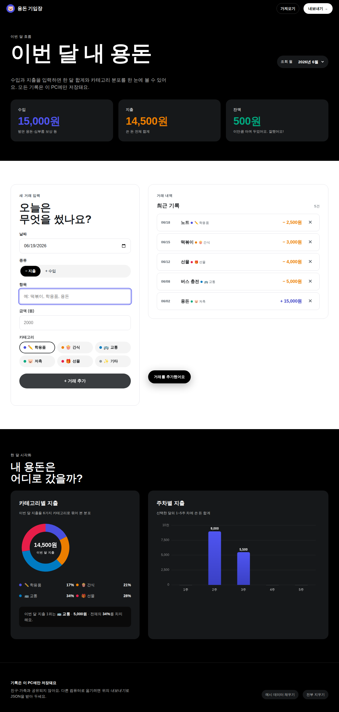

# Day 38 · 용돈 기입장 (학생 가계부)

> 1일 1바이브코딩 프로젝트 — **#038** 실과 과목 · 초등 4~6학년 대상.

수입과 지출을 입력하면 한 달 합계와 카테고리·주차별 분포를 도넛/바 차트로 보여 줍니다. 학생이 직접 자기 용돈 흐름을 기록하고 돌아보며 합리적 소비 습관을 익히도록 만들었어요.

## 데모

[**https://989-alt.github.io/project-38-yongdon-gibujang/**](https://989-alt.github.io/project-38-yongdon-gibujang/)



## 핵심 기능

- **거래 입력** — 날짜·종류(수입/지출)·항목·금액·카테고리 6종(학용품/간식/교통/저축/선물/기타).
- **이번 달 합계 카드** — 수입·지출·잔액. 잔액이 음수면 경고색으로 친절한 안내.
- **카테고리 도넛 차트** — Canvas로 자체 구현. 호버 없이도 범례에 비율 표시.
- **주차별 바 차트** — 1~5주 차 지출을 막대로. 그라데이션·반올림 모서리·격자 라벨.
- **월 셀렉터** — 과거 월도 조회. 거래가 있던 달은 자동으로 옵션에 등장.
- **JSON 내보내기/가져오기** — 다른 PC로 백업 이동. ID 중복은 자동으로 건너뜀.
- **localStorage 자동 저장** — 새로 고침해도 그대로. 모든 데이터는 이 PC에만.
- **예시 데이터** / **전부 지우기** — 첫 사용자가 분위기를 살피거나 리셋할 때 사용.

## 실행 방법

브라우저로 `index.html`을 열거나 정적 서버에 두면 끝납니다. 빌드 단계 없음.

```bash
python3 -m http.server 5180 --bind 127.0.0.1 --directory .
# → http://127.0.0.1:5180/
```

## 기술 스택

- 단일 `index.html` — HTML/CSS/Vanilla JS, **외부 의존성 0**.
- 차트는 Chart.js 대신 자체 Canvas 도넛·바 차트로 직접 그렸어요 (CDN 차단 환경 대비).
- 저장: `localStorage` 키 `piggybank-38-v1`.
- AI: **사용하지 않음** (Gemini 호출 0건).

## 적용한 skill

| 단계 | skill | 결과물 |
|---|---|---|
| Brainstormer | `brainstorming` | `docs/plans/01-brainstorm.md` — MUST/SHOULD/MUST-NOT 분리 |
| UI/UX | `ui-ux-pro-max` + `awesome-design-md` Revolut | `docs/plans/02-ui-ux.md` — 화면·토큰·접근성 |
| Full Stack Dev | `senior-devops` (코드 품질 원칙만) | `index.html` 단일 파일 |
| Tester | `webapp-testing` + Playwright | `tests/e2e.py` — 15-step 시나리오, 2 cycle PASS |

## 디자인 브랜드

**Revolut** — `awesome-design-md` 의 토큰을 그대로 적용.
- True black canvas + cobalt violet (`#494fdf`) 액센트
- 다크 storytelling 밴드 + 화이트 catalogue 밴드의 두-모드 시스템
- 모든 버튼 `border-radius: 9999px` (pill)
- 카드는 `20px` rounded, 입력은 `12px` rounded
- 시스템 폰트 스택 (Aeonik Pro 라이선스 없음 — Pretendard/Noto Sans KR로 폴백)

보조 톤은 **Mastercard**의 warm orange (`#ec7e00`) — 지출 카드 색에 활용.

## 개인정보·안전

- 학생 이름·번호·사진을 받지 않습니다.
- 모든 데이터는 브라우저 `localStorage`에만 저장. 외부 서버로 전송되지 않습니다.
- 가족·친구와 공유 기능 없음. 결제·은행 연동 없음. AI 호출 없음.

## 테스트

```bash
python3 ../1-day-1-code-project/webapp-testing/scripts/with_server.py \
  --server "python3 -m http.server 5180 --bind 127.0.0.1" --port 5180 \
  -- python3 tests/e2e.py
```

15-step Playwright e2e: 빈 상태 → 거래 추가 → 합계/리스트/차트 갱신 → 삭제 → 새로 고침 후 영속성 → 폼 검증 → JSON 내보내기 → 전부 지우기. **현재 0 failure / 0 console error**.

스크린샷은 `tests/screenshots/` 에 단계별로 저장됩니다.

## 라이선스

MIT. 학교·교실 자유 사용 환영.
